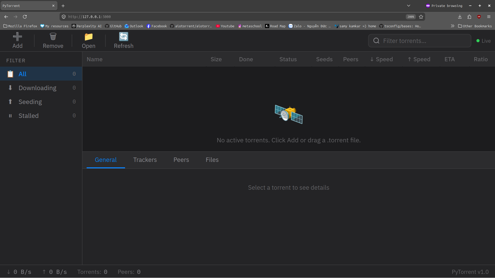
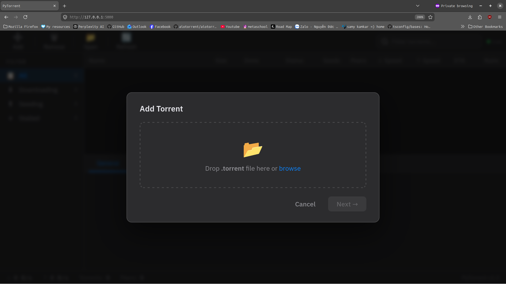
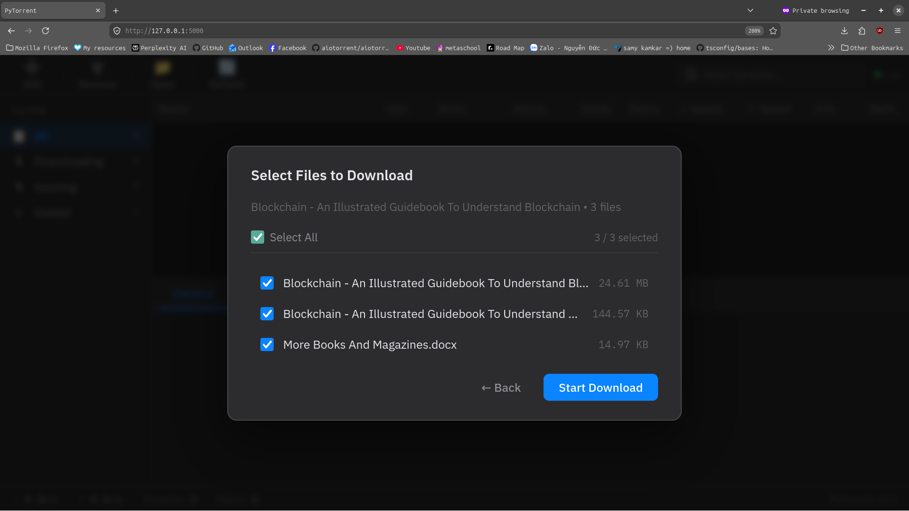
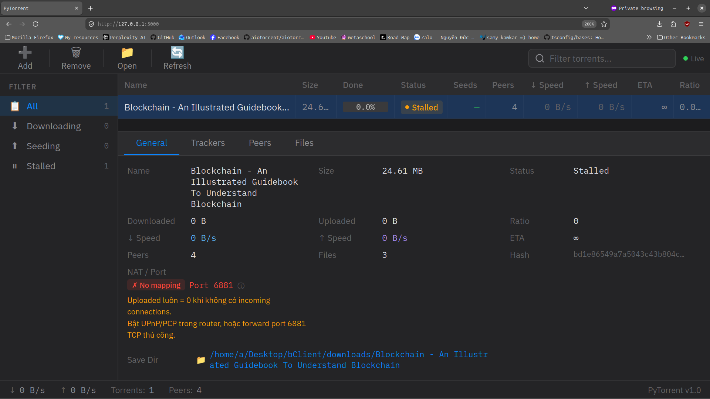

# BitTorrent Client

Ứng dụng BitTorrent với giao diện web, tuân thủ đặc tả BEP, tương thích với các client phổ biến như **qBittorrent**, **Transmission**, v.v.

---

## Tính năng
- Thuật toán rarest-first chọn chunk hiếm
- Tải song song nhiều peer tối ưu
- Giao diện web
- Tương thích đầy đủ với giao thức BitTorrent v1
- Theo dõi trạng thái tracker, peer và tiến trình tải từng file
- Thống kê tốc độ upload/download
- Quản lý peer bằng event (choke, unchoke) và giới hạn số lần kết nối lại bằng Time To Live
- ...

---

## Cài đặt

### Yêu cầu

- Python 3.8 trở lên

### Các bước cài đặt

**1. Clone repository và di chuyển vào thư mục dự án**

```bash
git clone <repository-url>
cd bittorrent-client
```

**2. Tạo và kích hoạt môi trường ảo**

```bash
python -m venv .venv
```

| Hệ điều hành | Lệnh kích hoạt |
|---|---|
| Linux / macOS | `source ./.venv/bin/activate` |
| Windows | `.venv\Scripts\activate.bat` |

**3. Cài đặt các thư viện phụ thuộc**

```bash
pip install -r requirements.txt
```

> **Lưu ý:** Nếu gặp lỗi trong quá trình cài đặt (mất kết nối, thiếu công cụ build, xung đột phiên bản), hãy cài đặt từng gói riêng lẻ:
> ```bash
> pip install <package_name>
> ```

---

## Chạy ứng dụng

```bash
python web/app.py
```

Ứng dụng sẽ khởi động tại: **http://127.0.0.1:5000**

> 📁 Các file tải về sẽ được lưu trong thư mục `downloads/`

---

## Hướng dẫn sử dụng

### 1. Trang chính

Giao diện tổng quan hiển thị danh sách các torrent đang được quản lý.



### 2. Thêm torrent

Nhấn nút **Add** ở góc màn hình để thêm file `.torrent`.

- Sử dụng file torrent có sẵn trong thư mục [`torrent_files/`](./torrent_files/) (khuyến nghị dùng [`abc.torrent`](./torrent_files/abc.torrent))
- Hoặc tải file torrent từ các trang như [1337x](https://1337x.to)



### 3. Chọn file cần tải

Sau khi thêm torrent, chọn các file bạn muốn tải xuống.



### 4. Theo dõi tiến trình tải

Giao diện hiển thị tốc độ, tiến trình và trạng thái tổng quan của torrent.



### 5. Thông tin chi tiết

| Tab | Mô tả |
|---|---|
| **Trackers** | Danh sách tracker và trạng thái kết nối — [xem ảnh](./imgs/trackers.png) |
| **Peers** | Các peer đang kết nối, trạng thái choke/unchoke — [xem ảnh](./imgs/peer.png) |
| **Files** | Danh sách file được chọn và tiến trình tải từng file — [xem ảnh](./imgs/files.png) |

---

## Cấu trúc dự án

```
├── pytorrent
│   ├── core
│   │   ├── bencode_wrapper.py
│   │   ├── constants.py
│   │   ├── file_utils.py
│   │   ├── __init__.py
│   │   ├── nat_traversal.py
│   │   ├── pwp_message_generator.py
│   │   ├── pwp_response_handler.py
│   │   ├── pwp_response_parse.py
│   │   ├── trackers.py
│   │   └── utils.py
│   ├── downloader.py
│   ├── download_manager.py
│   ├── __init__.py
│   ├── peer.py
│   ├── piece.py
│   ├── torrent.py
│   └── tracker_factory.py
├── pytorrent.log
├── README.md
├── requirements.txt
├── test.py
├── torrent_files
│   ├── 219055614C933242017A998555627FECA8D7A848.torrent
│   ├── 5A0EEC9BFF3FC5969CE5E3B58554C98C672C9BC9.torrent
│   ├── abc.torrent
│   └── D01D9438BA3449CDBE82D84F04D8963A13CEAD1A.torrent
└── web
    ├── app.py
    └── templates
        └── index.html
```
