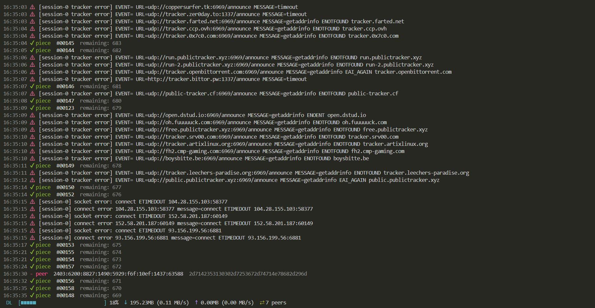

### MÔ TẢ
- CLI tải files từ mạng torrent tuân thủ theo các [BEP](https://www.bittorrent.org/beps/bep_0000.html) cơ bản.
- Bittorrent v1.
- Không hỗ trợ extension.
### Hướng dẫn cài đặt
- Yêu cầu
    + node ^24.0.0
    + git
```bash
git clone https://github.com/whisky81/bittorrent-client.git

cd bittorrent-client

npm install
```
### Hướng dẫn tải files từ mạng torrent
- flags
    + --torrent-file-path: đường dẫn tương đối hoặc tuyệt đối đến file .torrent 
        - có thể tải file torrent từ [1337x](https://www.1337x.tw/)
    + --save-dir: đường dẫn tương đối hoặc tuyệt đối đến thư mục lưu trữ (phải tồn tại)
```bash
node download.js --torrent-file-path <file_path> --save-dir <directory_path>
```
#### Ví dụ
```bash
node download.js --torrent-file-path ../Downloads/E2ED88DE112FCB9246335CFA8CE81E8D369C5479.torrent --save-dir ../torrent_down
```
